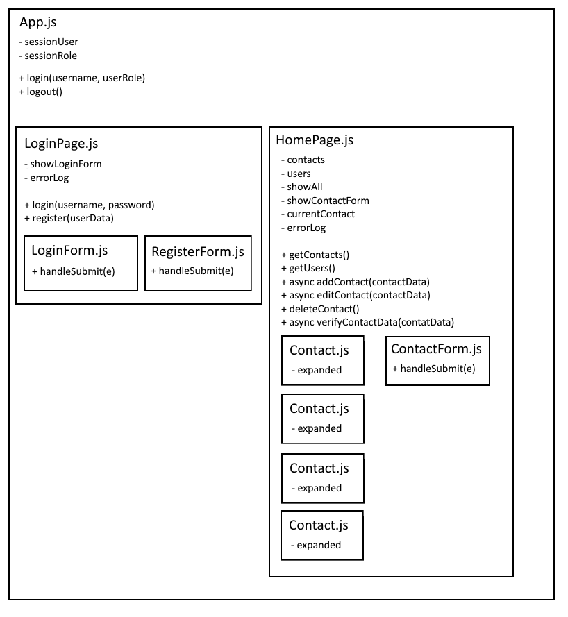
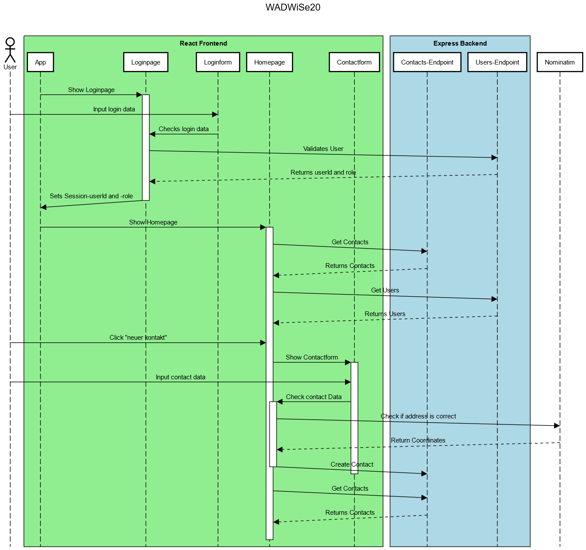

# WADWiSe20 - Julian Knepel

## Installation
Die Anwendung kann mit `npm install` installiert und mit `npm start` gestartet werden.

Die Standard User sind nutzername : admina, passwort : pass1234 und nutzername : normalo, passwort : pass1234.

Die Bestandteile des MERN Stacks haben die Ports MongoDB: 27017, Express: 3001, React: 3000.
Die MongoDB (Datenbank) liegt auf [Clever-Cloud](https://console.clever-cloud.com/?), kann aber zu localhost geändert werden.
Falls nötig können die URLs und Ports in den folgenden Dateien angepasst werden:

MongoDB
> server/routes/database.js

Express
> server/server.js

React
> src/utils/Api.js

## Aufbau
Grobe Skizze der für die Anwendung erstellten Komponenten und deren hierarschiche Anordnung.  

Sequenzdiagramm, welches die Abläufe der Anwendung darstellt, wenn der User sich einloggt und einen neuen Kontakt erstellt.  

## API-Endpoints
Das Express-Backend stellt die Endpoints "Users" und "Contacts" inklusive CRUD-Funktionalitäten bereit.
Die Endpoints können unter `localhost:3001/contacts`und `localhost:3001/users` erreicht werden.

## Verwendete Technologien und Links
* MERN Stack
* [Leaflet](https://leafletjs.com/) / [Openstreetmap](https://www.openstreetmap.org/) API
* [React-Color](https://www.npmjs.com/package/react-color)
* [Axios](https://www.npmjs.com/package/axios)
* [Prop-types](https://www.npmjs.com/package/prop-types)

Ordnerstruktur von : https://blog.alexdevero.com/build-react-app-express-api/
